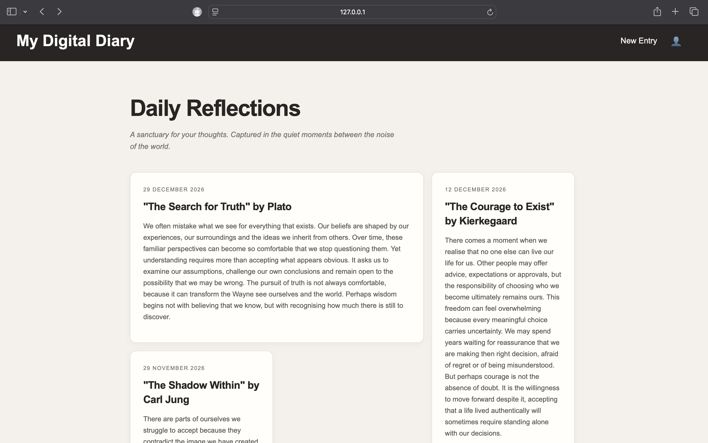

# My Digital Diary

My Digital Diary is a simple multi-page website where users can write, save and look back at their personal thoughts and reflections.

I created this project using HTML, CSS and JavaScript. The main aim was to practise building a website with multiple pages, using JavaScript to make the pages interactive and using localStorage to save information in the browser.

## Screenshot



## Features

The website includes:

- A Home page showing the five most recent diary entries
- A New Entry page where users can write a new diary entry
- A Vault page where all saved diary entries can be viewed
- A title, date and reflection field for each entry
- A delete button for removing entries
- A confirmation message before an entry is deleted
- localStorage for keeping diary entries saved in the browser
- Responsive layouts using CSS Grid and Flexbox
- Navigation links between the different pages
- Diary cards created dynamically using JavaScript

## How the Five Most Recent Entries Work

The Home page is designed to show only the five most recently saved diary entries.

When a new entry is created, it is added to the end of the entries array using `push()`.

When the Home page loads, JavaScript gets the saved entries from localStorage and uses:

```javascript
const latestEntries = entries.slice(-5).reverse();
```

The `slice(-5)` part selects the last five entries in the array. The `reverse()` part then displays the newest entry first.

This means that even if there are many entries saved in the diary, the Home page only shows the five most recent ones.

The Vault page is different because it displays all of the saved entries.

## Technologies Used

I used the following technologies to create the project:

- HTML5
- CSS3
- JavaScript
- CSS Grid
- Flexbox
- DOM manipulation
- JSON
- localStorage

## Project Structure

The project is made up of three HTML pages and separate CSS and JavaScript files.

```text
My Digital Diary/
│
├── index.html
├── new-entry.html
├── vault.html
├── style.css
├── index.js
├── script.js
├── vault.js
└── README.md
```

## How It Works

The website is split into three main pages.

The Home page is the main page of the diary. It displays the most recent entries and provides links to create a new entry or view the full archive.

The New Entry page contains a form where the user can enter their diary information.

The Vault page acts as the archive. It displays all the entries that have been saved and gives the user the option to delete an entry.

JavaScript is used to connect the pages with the saved data and create the diary cards dynamically.

## Creating an Entry

On the New Entry page, the user can enter:

- A title
- A date
- A reflection

When the form is submitted, JavaScript prevents the page from refreshing and gets the values entered into the form.

An entry object is then created containing the title, date, reflection and a unique ID.

The new entry is added to the existing entries array and saved to localStorage.

A message is also displayed to confirm that the entry has been saved successfully.

## Home Page

The Home page displays the five most recently saved entries.

The diary cards are created using JavaScript rather than being manually written into the HTML.

Each card displays:

- The date
- The title
- The reflection

If there are no entries saved, the page displays a message encouraging the user to create their first diary entry.

## Vault

The Vault is the full archive of the diary.

Unlike the Home page, the Vault displays all saved entries.

Each entry has a Delete button. When the user clicks Delete, a confirmation message appears before the entry is removed.

If the user confirms the deletion, the entry is removed from the array and localStorage is updated.

If the user chooses Cancel, the entry remains in the diary.

## Data Storage

The diary uses the browser's localStorage to save the entries.

The entries are stored under the key:

```javascript
"diaryEntries"
```

Before saving the data, the JavaScript converts the entries array into a JSON string using:

```javascript
JSON.stringify(entries)
```

When the data needs to be used again, it is converted back into JavaScript data using:

```javascript
JSON.parse(localStorage.getItem("diaryEntries"))
```

This allows the diary entries to remain saved when the user closes and reopens the browser.

## localStorage Documentation

The diary entries are stored in the browser using localStorage.

I use the key `"diaryEntries"` to save and retrieve the diary entries.

The entries are converted into a JSON string when they are saved using `JSON.stringify()` and converted back into JavaScript data using `JSON.parse()` when they are retrieved.

For example:

```javascript
localStorage.setItem("diaryEntries", JSON.stringify(entries));

## Project Purpose

The purpose of this project was to practise creating a functional website using HTML, CSS and JavaScript.

The project helped me practise creating multiple HTML pages and connecting them together with navigation links.

It also allowed me to practise JavaScript concepts such as:

- Variables
- Arrays
- Objects
- Functions
- Event listeners
- Form handling
- DOM manipulation
- JSON
- localStorage

I also used CSS Grid and Flexbox to create the layout and make the diary responsive on different screen sizes.

Overall, the project combines the different skills I have been learning into one functional website.

## Author

Created as part of my web development coursework.